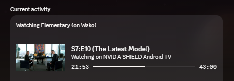

# Ascend Media RPC (RPC & Auto Skip)

**Ascend Media RPC** is the ultimate companion for your media experience on Android TV. It combines a high-performance **Discord RPC Controller**, **Multi-Provider Auto Skip**, and a **Web Dashboard** into one seamless package.

## 🚀 Key Features

### 🎮 Dynamic Discord Presence
*   **Genre-Specific Personas**: Automatically switch Discord IDs for Anime, Horror, Movies, and more.
*   **Phased Status Cycling**: Real-time rotations showing Ratings (TMDB), Cast, and Title info.
*   **Interactive Buttons**: One-click access to TMDB pages and trailers directly from your Discord profile.
*   **Streaming Mode**: Intelligent detection and display of what platform you're streaming on (Netflix, VLC, etc.).
*   **Artwork Priority**: Choose your preferred visuals—focus on Episode Stills, Season PostSets, or Show Posters.
*   **Rating Badges**: In-line critic scores (IMDb, RT) directly on your presence.

### 🎖️ Dynamic Small Icon (Badge) Modes
Customize your Discord presence badge with several real-time modes:
- **Playback Status**: Live Play/Pause indicators.
- **App Branding**: Show Stremio or Wako icons.
- **Hardware Identity**: Display your network status or specific device logo (NVIDIA Shield, CCwGTV).
- **Streaming Service**: Show the icon of the current app you're using.

### ⏭️ Multi-Source Auto Skip (Beyond IntroSkip)
Ascend Media RPC integrates with the world's most robust skip providers:
- **IntroSkip**: Crowdsourced intro points for millions of episodes.
- **TIDB**: The Internet Database for skip points.
- **AniSkip**: Global standard for Anime skip points.
- **VideoSkip**: Powerful community-driven skip point exchange.
- **IntroHater**: Advanced local detection for repetitive patterns.
- **Remote JSON**: Sync skip points from custom external databases.

### 🕵️ Wako "UI Heist" Fallback
Never miss a status update. If Stremio's metadata is missing, RPC performs a "UI Heist" on Wako to extract title and episode info directly from the screen hierarchy.

### 📊 Real-Time Analytics
Track your watch history with a hardware-accelerated dashboard showing total watch hours and library completion rates.

---

## 🛠️ Prerequisites

### 1. Android TV Setup
Enable ADB debugging on your TV (Settings > About > Click Build Number 7 times > Developer Options > Network Debugging).

### 2. TMDB API Key
Get a free key at [themoviedb.org](https://www.themoviedb.org/settings/api).

---

## 🏗️ Installation (Portable)

1.  **Download** the latest release.
2.  **Run `run.bat`**.
    *   On the first run, the system will automatically check for Python and install all dependencies.
    *   If you have the Vencord build folder, it will guide you through Node.js setup if needed.

---

*This project is an independent community tool and is not affiliated with Stremio or Wako TV.*
