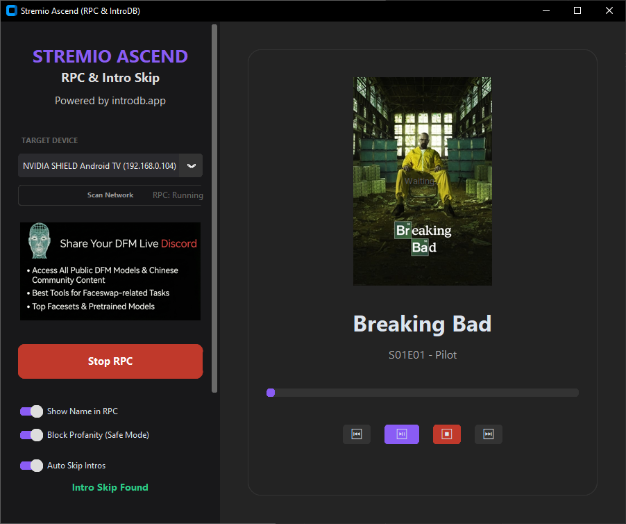
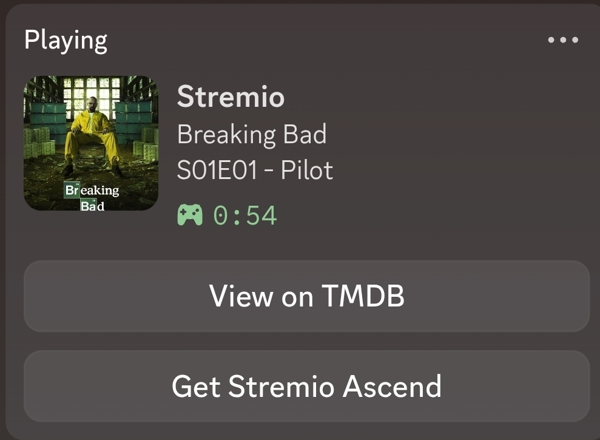

  
  
# Stremio Ascend

### The Ultimate Companion for Stremio on Android TV
  
  
  
  
  

  

    <b>Rich Presence</b> • <b>Intro Skipping</b> • <b>Web Remote</b> • <b>Device Control</b>
  

---

## 🔥 Overview

**Stremio Ascend** is a powerful standalone application that supercharges your Stremio experience on Android TV. By connecting via ADB, it seamlessly extracts playback status to display on **Discord Rich Presence**, automates **Intro Skipping**, and provides a beautiful **Web Remote** for controlling your TV from any device.

## ✨ Key Features

### 🎮 Discord Rich Presence (RPC)

* **Real-time Status**: Displays what you're watching, including Show Name, Episode, and Time Remaining.
* **Dynamic Artwork**: Fetches high-quality posters from TMDB automatically.

### ⏭️ Smart Intro Skipping

* **Powered by IntroDB**: Uses community-sourced intro timestamps to automatically skip opening sequences.
* **Zero Configuration**: Just enable "Auto Skip" and enjoy seamless playback.

### 🌐 Web Remote Control

* **Responsive UI**: Control your TV from your phone, tablet, or laptop browser.
* **Playback Controls**: Play, Pause, Stop, Next, Previous.
* **Absolute Seeking**: Jump to specific timestamps instantly.
* **Dynamic Backgrounds**: The web interface adapts to the current movie/show poster.

### 📺 Device Management

* **Auto-Scan**: Automatically discovers Android TV devices on your network.
* **One-Click Connect**: Remembers your device for instant connection.

---

## 🚀 Installation & Usage

### Standalone Executable (Windows)

**No Python required.**

1. Download `Stremio_Ascend.exe`.
2. Run the application.
3. Enter your TV's IP address (or use "Scan Network").
4. Click **Connect ADB** (Accept the prompt on your TV if it appears).
5. Click **Start RPC**!

---

## 🛠️ Configuration

The application creates a `config.json` file automatically. You can edit this via the GUI Settings panel.

| Setting | Description |
| :--- | :--- |
| **ADB Host** | IP Address of your Android TV. |
| **TMDB API Key** | (Optional) Your own TMDB Key for poster fetching. |
| **Show Device Name** | Toggle device name display in Discord status. |
| **Profanity Filter** | Mask minimal explicit language in titles. |
| **Auto Skip** | Enable/Disable automated intro skipping. |

---

## 📄 License

Distributed under the MIT License. See `LICENSE` for more information.

---

  Built with 🍪 by Cxsmo

