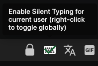
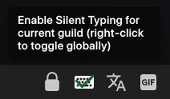

# SilentTyping

Enhanced version of SilentTyping with the feature to disable it for specific guilds or users

# Installation
See [here](https://github.com/D3SOX/vencord-userplugins#install) and the [Vencord docs for installing custom plugins](https://docs.vencord.dev/installing/custom-plugins/)
